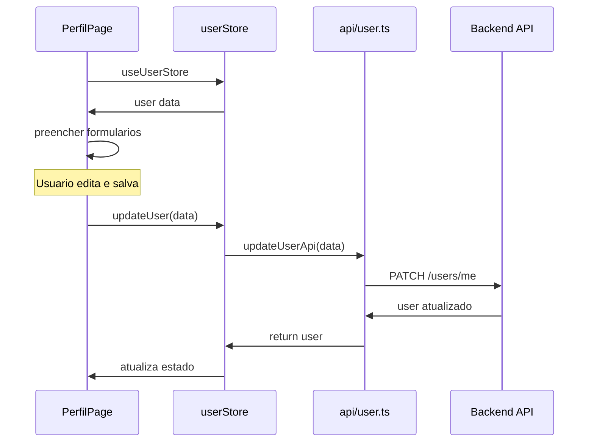

# Integrar Pagina de Perfil com API do Backend

## Situacao Atual

A pagina de perfil (`app/perfil/page.tsx`) usa dados mockados de `musicianDetails[0]`. Ja existe um `userStore` funcional com login/logout, mas falta:

- Endpoint de update do usuario
- Types completos do `MusicianProfile`
- Action `updateUser` no store
- Integracao da pagina com o store

## Arquitetura da Solucao



## Alteracoes Necessarias

### 1. Corrigir URL da API (Bug)

No arquivo [`api/auth.ts`](api/auth.ts), a URL esta incorreta:

- Atual: `/user/me`
- Correto: `/users/me` (com "s", conforme backend)

### 2. Expandir Types do MusicianProfile

Atualizar [`lib/types/user.ts`](lib/types/user.ts) para incluir todos os campos retornados pelo backend:

```typescript
export interface MusicianProfile {
  id: number;
  category?: string;
  bio?: string;
  location?: string;
  priceFrom?: number;
  experience?: string;
  equipment?: string;
  availability?: string;
  rating?: number;
  ratingCount?: number;
  eventsCount?: number;
  satisfactionRate?: number;
  responseTime?: string;
  isFeatured?: boolean;
  genres: Array<{ id: number; name: string; slug: string }>;
  instruments: Array<{ id: number; name: string; slug: string }>;
  createdAt: string;
  updatedAt: string;
}
```

### 3. Criar Funcao de Update na API

Adicionar no [`api/user.ts`](api/user.ts) a funcao `updateUserApi`:

```typescript
export interface UpdateUserData {
  firstName?: string;
  lastName?: string;
  phone?: string;
  city?: string;
  state?: string;
}

export async function updateUserApi(data: UpdateUserData): Promise<User>
```

### 4. Adicionar Action no Store

Atualizar [`lib/stores/userStore.ts`](lib/stores/userStore.ts):

- Adicionar action `updateUser(data)` que chama a API e atualiza o estado

### 5. Refatorar Pagina de Perfil

Atualizar [`app/perfil/page.tsx`](app/perfil/page.tsx):

- Importar e usar `useUserStore` para obter dados do usuario
- Substituir dados mock pelos dados reais do store
- Chamar `updateUser` ao salvar formulario
- Adicionar estados de loading durante salvamento
- Redirecionar para login se nao estiver logado